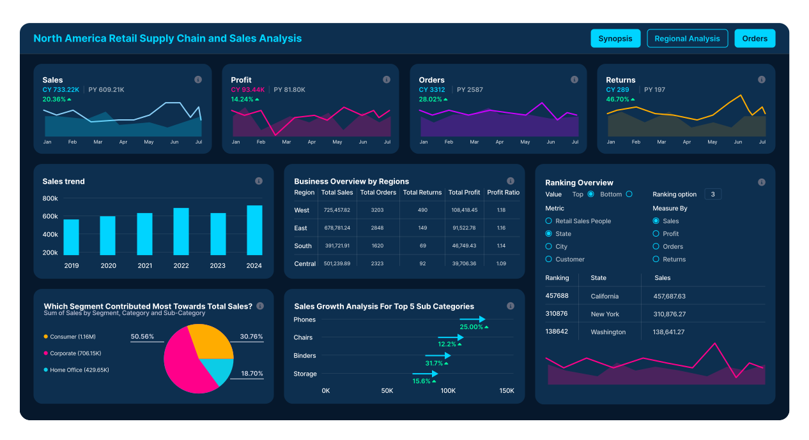
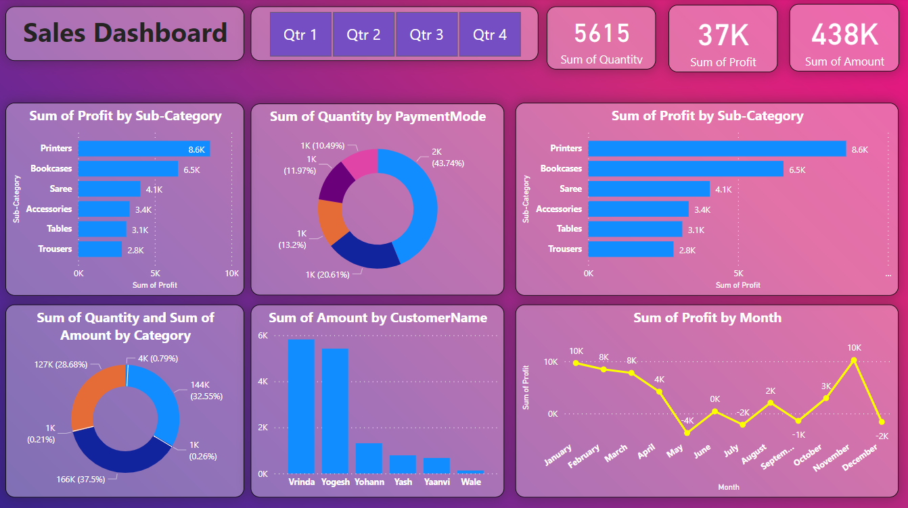

# 🛒 電子商務分析 Power BI 專案

這是一個專為電子商務數據打造的 Power BI 報表範本。透過此範本，您可以快速掌握銷售趨勢、產品表現與客戶分布。

---

## 📥 檔案下載

### 1. 下載 Power BI 範本 (.pbit)
請點擊下方連結下載報表結構檔案：
* [**下載 我的作品.pbit**](#)  
  *(註：.pbit 檔案僅包含報表設計，不含實際數據，需手動串接下方資料源)*

### 2. 下載範例資料 (.csv)
請下載此 CSV 檔案作為報表的數據來源：
* [**下載 Sales_csv.csv**](#)

---

## 🚀 使用方式

請遵循以下步驟完成資料夾路徑設定，以正常顯示圖表：

### 步驟 1：開啟範本
雙擊開啟 **「我的作品.pbit」**。

### 步驟 2：輸入資料來源路徑
開啟檔案後，Power BI 會自動偵測到遺失的路徑，並彈出 **「資料來源提示」** 視窗（或進入「資料轉換」參數頁面）。

### 步驟 3：路徑對接
在路徑輸入框中，請輸入您 **「解壓縮後的 Sales_csv.csv」** 完整的電腦路徑。

> **💡 範例路徑參考：**
> `C:\Users\Username\Downloads\Sales_csv.csv`

### 步驟 4：套用變更
點擊「載入」或「套用變更」，系統將自動讀取 CSV 資料並生成視覺化分析結果。

---

## 📊 報表預覽

| 銷售總覽 | 客戶分析 | 產品排行 |
| :---: | :---: | :---: |
|  |  |  |

---

## 🛠 系統需求
* **Power BI Desktop** (建議更新至最新版本)
* 基礎 Excel/CSV 處理能力

---
感謝使用此專案！若有任何問題，歡迎透過 Issue 留言。